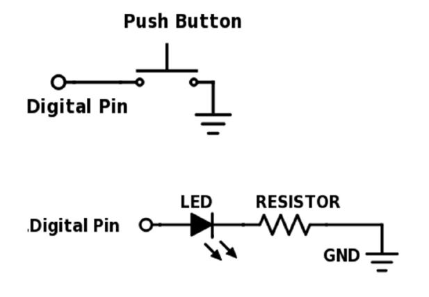
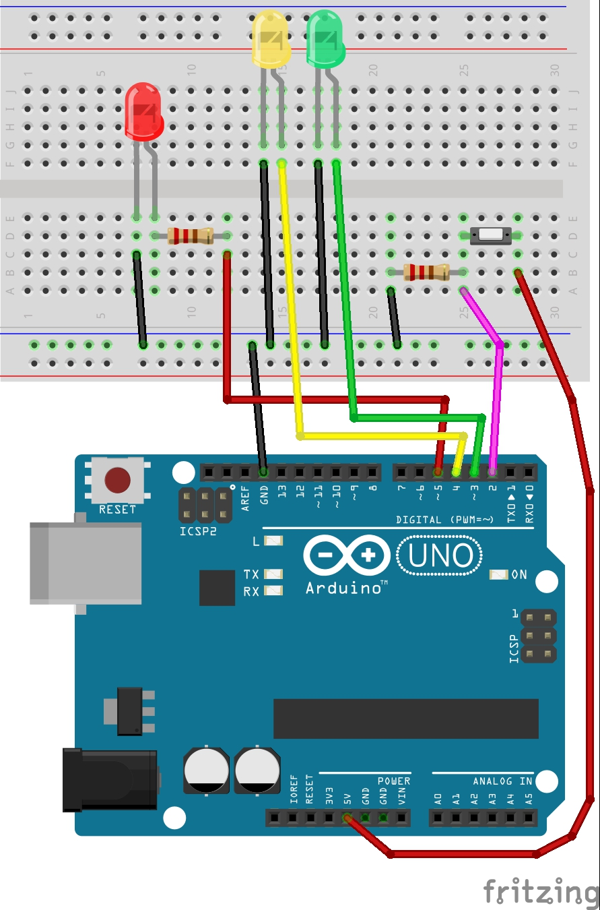
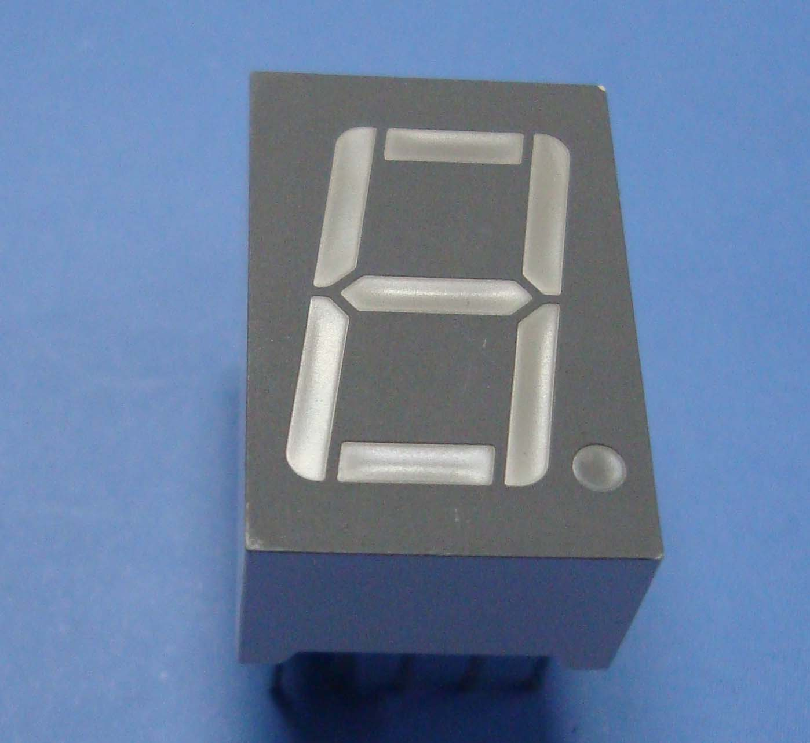
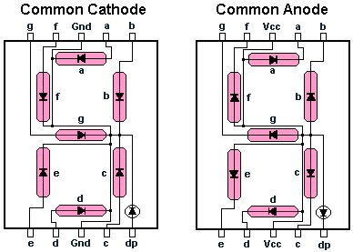
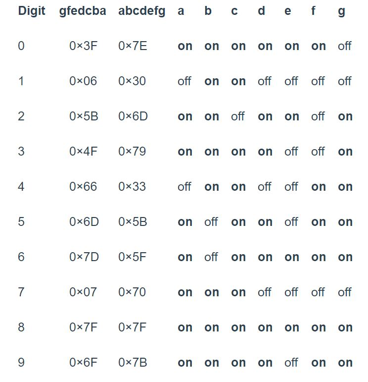
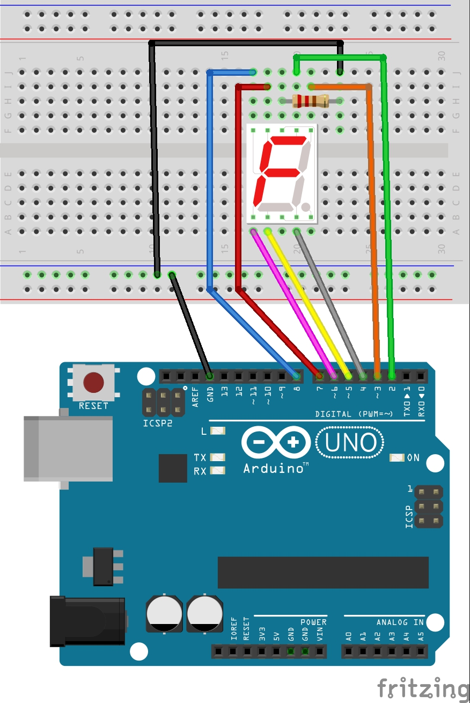
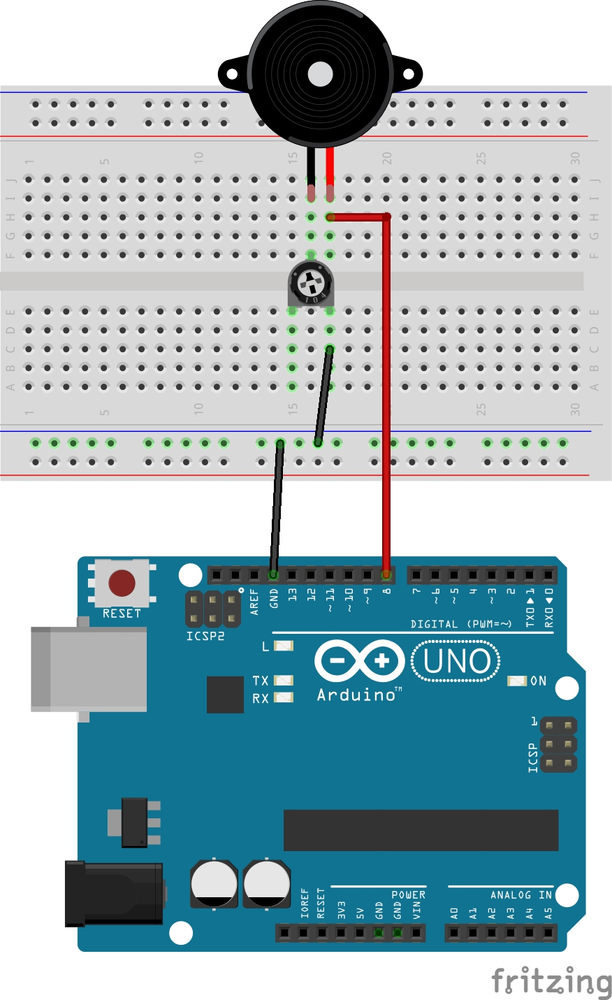

# BMES Advanced Arduino Workshop

*by Anson Fu for NTU Biomedical Engineering Society*

This workshop is based on ARDUINO IDE 1.8.5, ARDUINO UNO R3 Board and assumes basic knowledge of C++ Language and electronic protot.

***Disclaimer*** *-* *This document is only meant to serve as a reference for the attendees of the workshop. It does not cover all the concepts or implementation details discussed during the actual workshop.*

<hr>

### Workshop Details:

**When?**: Satauday, 12 May 2018. 2:00 PM - 6:00 PM.</br>
**Where?**: TR +27, The Hive, Nanyang Technological University</br>
**Who?**: NTU Biomedical Engineering Society

<hr>

## Content
### 1. Binary Counter
### 2. 7 Segment Display
### 3. Buzzer
### 4. LCD Display

## Activity 1 Binary Counter

### 1.1 Introduction to Binary
Number systems are the methods we use to represent numbers. Binary just uses two digits, 0
and 1. Binary is also known as a base-2 number system.
### 1.2 Counting In Binary
In the base-10 number system, each digit represents a value of 10x, where X is the digit
placement from the right, starting from zero and multiplying by that digit value. For example,
123 in decimal is: </br>
1×102+3×101+3×100=123. </br>
123 in binary would be: </br>
1×26+1×25+1×24+1×23+0×22+1×21+1×20=123. </br>

### 1.3 LED Binary Counter
Let's create a counter that counts in binary.


```C+
int button = 2; //set to correct pin
int presses = 0;
long time = 0;
long debounce = 100;
const byte numPins = 3; //number of pins we use
byte LEDpins[] = {3, 4, 5}; //set to correct pins

void setup() {
  Serial.begin(9600);
  for(int i = 0; i < numPins; i++) {
      pinMode(LEDpins[i], OUTPUT);
      }
  pinMode(button, INPUT_PULLUP); //monitors the state of a switch 
  attachInterrupt(0, count, LOW); //function count is triggerd when pin 0 is LOW 
  }
  
void loop() {
  String binNumber = String(presses, BIN); //give a string of binary number
  int binLength = binNumber.length(); //get the length from binary number
  boolean led0 = binNumber.charAt(binNumber.length()-1)=='1'; //search for '1' at specific location, true when '1' is found
  boolean led1 = binNumber.charAt(binNumber.length()-2)=='1';
  boolean led2 = binNumber.charAt(binNumber.length()-3)=='1';
  if(presses <= 7) {
     digitalWrite(LEDpins[0],led0);
     digitalWrite(LEDpins[1],led1);
     digitalWrite(LEDpins[2],led2);
  } else {
    presses = 0;
    }
  }
  
void count() {
  if(millis() - time > debounce){
    presses++;
    }
  time = millis();
  }
```


## Activity 2 Seven Segment Display
If your Arduino application only needs to display numbers, consider using a seven-segment display. The severn-segment display has seven LEDs arranged in the shape of number eight. They are easy to use and cost effective. The picture below shows a typical seven-segment display.</br>

### 2.1 Common Anode and Common Cathode
Seven segment displays are of two types: common anode and common cathode. The Internal structure of both types is nearly the same. The difference is the polarity of the LEDs and common terminal. </br>
#### 2.1.1 Common Cathode
In a common cathode seven-segment display, all seven LEDs plus a dot LED have the cathodes connected to pins 2 and pin 8. To use this display, we need to connect GROUND to pin 2 and pin 8 and,  and connect +5V to the other pins to make the individual segments light up.</br> 

#### 2.1.2 Common Anode
The common anode display is the exact opposite. In a common-anode display, the positive terminal of all the eight LEDs  are connected together and then connected to pin 3 and pin 8. To turn on an individual segment, you ground one of the pins. </br>
 </br>
### 2.2 Configuration
The seven segment are labelled a-g, with the dot being "dp," as shown in the figure below: </br>

To display a particular number, you turn on the individual segments as shown in the table below: </br>

### 2.3 Connect 7 segment display to Arduino Board

### 2.4 Experiments
#### 2.4.1 Turn on and off
In this experiment, we will simply turn on and turn off the LEDs to get familiar with how a seven-segment display works.
```C++
void setup()
{
  // define pin modes
  
 pinMode(2,OUTPUT);
 pinMode(3,OUTPUT);
 pinMode(4,OUTPUT);
 pinMode(5,OUTPUT);
 pinMode(6,OUTPUT);
 pinMode(7,OUTPUT);
 pinMode(8,OUTPUT);
 
}

void loop() 
{
  // loop to turn leds od seven seg ON
  
  for(int i=2;i<9;i++)
  {
    digitalWrite(i,HIGH);
    delay(600);
  }
  
  // loop to turn leds od seven seg OFF
  for(int i=2;i<9;i++)
  {
    digitalWrite(i,LOW);
    delay(600);
  }
  delay(1000);
}
```
#### 2.4.2 Show numbers
In this experiment, we will turn on specific LEDs to show numbers.
```C++
#define segA 2//connecting segment A to PIN2

#define segB 3// connecting segment B to PIN3

#define segC 4// connecting segment C to PIN4

#define segD 5// connecting segment D to PIN5

#define segE 6// connecting segment E to PIN6

#define segF 7// connecting segment F to PIN7

#define segG 8// connecting segment G to PIN8

void setup() 
{
  for (int i=2;i<9;i++) {
    pinMode(i, OUTPUT);// taking all pins from 2-8 as output
    }

}

void loop()
{  // To show number 0

   digitalWrite(segA, HIGH);

   digitalWrite(segB, HIGH);

   digitalWrite(segC, HIGH);

   digitalWrite(segD, HIGH);

   digitalWrite(segE, HIGH);

   digitalWrite(segF, HIGH);

   digitalWrite(segG, LOW);
  }
```
#### 2.4.3 Count Up 
In this experiment, we will count up numbers.
```C++
#define segA 2//connecting segment A to PIN2
#define segB 3// connecting segment B to PIN3
#define segC 4// connecting segment C to PIN4
#define segD 5// connecting segment D to PIN5
#define segE 6// connecting segment E to PIN6
#define segF 7// connecting segment F to PIN7
#define segG 8// connecting segment G to PIN8

int COUNT=0;//count integer for 0-9 increment

void setup() 
{
  for (int i=2;i<9;i++) {
    pinMode(i, OUTPUT);// taking all pins from 2-8 as output
    }

}

void loop() 
{
switch(COUNT)
{ 
  case 0://when count value is zero show”0” on disp

  digitalWrite(segA, HIGH);
  digitalWrite(segB, HIGH);
  digitalWrite(segC, HIGH);
  digitalWrite(segD, HIGH);
  digitalWrite(segE, HIGH);
  digitalWrite(segF, HIGH);
  digitalWrite(segG, LOW);

  break;

  case 1:// when count value is 1 show”1” on disp

  digitalWrite(segA, LOW);
  digitalWrite(segB, HIGH);
  digitalWrite(segC, HIGH);
  digitalWrite(segD, LOW);
  digitalWrite(segE, LOW);
  digitalWrite(segF, LOW);
  digitalWrite(segG, LOW);

  break;

  case 2:// when count value is 2 show”2” on disp

  digitalWrite(segA, HIGH);
  digitalWrite(segB, HIGH);
  digitalWrite(segC, LOW);
  digitalWrite(segD, HIGH);
  digitalWrite(segE, HIGH);
  digitalWrite(segF, LOW);
  digitalWrite(segG, HIGH);

  break;

  case 3:// when count value is 3 show”3” on disp

  digitalWrite(segA, HIGH);
  digitalWrite(segB, HIGH);
  digitalWrite(segC, HIGH);
  digitalWrite(segD, HIGH);
  digitalWrite(segE, LOW);
  digitalWrite(segF, LOW);
  digitalWrite(segG, HIGH);

  break;

  case 4:// when count value is 4 show”4” on disp

  digitalWrite(segA, LOW);
  digitalWrite(segB, HIGH);
  digitalWrite(segC, HIGH);
  digitalWrite(segD, LOW);
  digitalWrite(segE, LOW);
  digitalWrite(segF, HIGH);
  digitalWrite(segG, HIGH);

  break;

  case 5:// when count value is 5 show”5” on disp

  digitalWrite(segA, HIGH);
  digitalWrite(segB, LOW);
  digitalWrite(segC, HIGH);
  digitalWrite(segD, HIGH);
  digitalWrite(segE, LOW);
  digitalWrite(segF, HIGH);
  digitalWrite(segG, HIGH);

  break;

  case 6:// when count value is 6 show”6” on disp

  digitalWrite(segA, HIGH);
  digitalWrite(segB, LOW);
  digitalWrite(segC, HIGH);
  digitalWrite(segD, HIGH);
  digitalWrite(segE, HIGH);
  digitalWrite(segF, HIGH);
  digitalWrite(segG, HIGH);

  break;

  case 7:// when count value is 7 show”7” on disp

  digitalWrite(segA, HIGH);
  digitalWrite(segB, HIGH);
  digitalWrite(segC, HIGH);
  digitalWrite(segD, LOW);
  digitalWrite(segE, LOW);
  digitalWrite(segF, LOW);
  digitalWrite(segG, LOW);

  break;

  case 8:// when count value is 8 show”8” on disp

  digitalWrite(segA, HIGH);
  digitalWrite(segB, HIGH);
  digitalWrite(segC, HIGH);
  digitalWrite(segD, HIGH);
  digitalWrite(segE, HIGH);
  digitalWrite(segF, HIGH);
  digitalWrite(segG, HIGH);

  break;

  case 9:// when count value is 9 show”9” on disp

  digitalWrite(segA, HIGH);
  digitalWrite(segB, HIGH);
  digitalWrite(segC, HIGH);
  digitalWrite(segD, HIGH);
  digitalWrite(segE, LOW);
  digitalWrite(segF, HIGH);
  digitalWrite(segG, HIGH);

  break;

  break;
}
  if (COUNT<10) {
    COUNT++;
    delay(1000);///increment count integer for every second
   }
    if (COUNT==10) {
        COUNT=0;// if count integer value is equal to 10, reset it to zero.
         delay(1000);
     }
}
```

#### 2.4.3 Count Down
In this experiment, we will count up numbers.
```C++
// make an array to save Seven Seg pin configuration of numbers

int num_array[10][7] = {  { 1,1,1,1,1,1,0 },    // 0
                          { 0,1,1,0,0,0,0 },    // 1
                          { 1,1,0,1,1,0,1 },    // 2
                          { 1,1,1,1,0,0,1 },    // 3
                          { 0,1,1,0,0,1,1 },    // 4
                          { 1,0,1,1,0,1,1 },    // 5
                          { 1,0,1,1,1,1,1 },    // 6
                          { 1,1,1,0,0,0,0 },    // 7
                          { 1,1,1,1,1,1,1 },    // 8
                          { 1,1,1,0,0,1,1 }};   // 9
                                       
//function header
void Num_Write(int);

void setup() 
{ 
  // set pin modes
  pinMode(2, OUTPUT);   
  pinMode(3, OUTPUT);
  pinMode(4, OUTPUT);
  pinMode(5, OUTPUT);
  pinMode(6, OUTPUT);
  pinMode(7, OUTPUT);
  pinMode(8, OUTPUT);
}

void loop() 
{
  
  //counter loop
  
  for (int counter = 10; counter > 0; --counter) 
  {
   delay(1000);
   Num_Write(counter-1); 
  }
  delay(3000);
}

// this functions writes values to the sev seg pins  
void Num_Write(int number) 
{
  int pin= 2;
  for (int j=0; j < 7; j++) {
   digitalWrite(pin, num_array[number][j]);
   pin++;
  }
}
```
#### 2.4.4 Generate Random Number with Switch
```C+
int segment[7] = {2, 3, 4, 5, 6, 7, 8, };      //pins used
int numbers[11][7] = { //numbers array, 1 for LOW and 0 for HIGH. Always with the .
    { 1,1,1,1,1,1,0 },    // 0
    { 0,1,1,0,0,0,0 },    // 1
    { 1,1,0,1,1,0,1 },    // 2
    { 1,1,1,1,0,0,1 },    // 3
    { 0,1,1,0,0,1,1 },    // 4
    { 1,0,1,1,0,1,1 },    // 5
    { 1,0,1,1,1,1,1 },    // 6
    { 1,1,1,0,0,0,0 },    // 7
    { 1,1,1,1,1,1,1 },    // 8
    { 1,1,1,0,0,1,1 }};   // 9
    {0,0,0,0,0,0,0,0} //NULL
};

void setup(){
  for(int a=0; a<7; a++){
    pinMode(segment[a], OUTPUT);}
    pinMode(10, INPUT);  //button switch
}
  
void showNumber(int randNr){  //function to show the number on the 7 segment display
  for(int a=0; a<7; a++){
    digitalWrite(segment[a], numbers[randNr][a] == 1 ? LOW : HIGH);}  //checks the segment and returns LOW if 1 and HIGH if 0
}

void loop(){
  int speed = 100;    //the speed at which numbers on the display will change
  bool STOP = false;
  while(STOP == false){   //the loop to generate random numbers
    showNumber(random(0,9));
      delay(100);
        if(digitalRead(10) == HIGH){  //when the button is pressed, loop ends
          STOP = true;}
  }
  
  for(int i=0; i<random(7,15); i++){  //i was thinking it would look more appealing if the numbers would slow down
    showNumber(random(0,9));      //rather than just quickly stopping for more dramatic effect lol
    delay(speed);           //will slowdown in between 7 and 15 random numbers
    speed+=100;             //each nerw random number will be generated at a slower pace
  }
  
  int randomNr = random(0,9);     //this is the random number that was generated
  
  STOP = false;             //a new loop to blink on and off (randomNr and NULL)
    while(STOP == false){
      showNumber(randomNr);
      delay(1000);
      showNumber(10);
      delay(1000);
        if(digitalRead(10) == HIGH){  //why not have another go, jumps back to loop() function
          STOP = true;}
   }
  delay(1000);              //after 1s offcourse
}
```

### Activity 3 Buzzer
In this tutorial, we are going to Interface piezo buzzer or piezo speaker with Arduino UNO. A piezo buzzer is generally used to signal user in the form of tone or beep. This type of buzzer widely used in alarm, domestic gadgets or in embedded systems product to provide some kind of indication or alert.Buy designing a small circuit we can interface it easily with Arduino. We will design a small transistorized circuit and by providing high signal we can get a tone signal from the piezo buzzer.

#### 3.1 Make some noise
```C++
const int buzzer = 9; //buzzer to arduino pin 9

void setup(){
 
  pinMode(buzzer, OUTPUT); // Set buzzer - pin 9 as an output

}

void loop(){
 
  tone(buzzer, 1000); // Send 1KHz sound signal...
  delay(1000);        // ...for 1 sec
  noTone(buzzer);     // Stop sound...
  delay(1000);        // ...for 1sec
  
}
```
#### 3.2 Play Melody
```C++
// TONES  ==========================================
// Start by defining the relationship between 
//       note, period, &  frequency. 
#define  c     3830    // 261 Hz 
#define  d     3400    // 294 Hz 
#define  e     3038    // 329 Hz 
#define  f     2864    // 349 Hz 
#define  g     2550    // 392 Hz 
#define  a     2272    // 440 Hz 
#define  b     2028    // 493 Hz 
#define  C     1912    // 523 Hz 
// Define a special note, 'R', to represent a rest
#define  R     0

// SETUP ============================================
// Set up speaker on a PWM pin (digital 9, 10 or 11)
int speakerOut = 9;
// Do we want debugging on serial out? 1 for yes, 0 for no
int DEBUG = 1;

void setup() { 
  pinMode(speakerOut, OUTPUT);
  if (DEBUG) { 
    Serial.begin(9600); // Set serial out if we want debugging
  } 
}

// MELODY and TIMING  =======================================
//  melody[] is an array of notes, accompanied by beats[], 
//  which sets each note's relative length (higher #, longer note) 
int melody[] = {  C,  b,  g,  C,  b,   e,  R,  C,  c,  g, a, C };
int beats[]  = { 16, 16, 16,  8,  8,  16, 32, 16, 16, 16, 8, 8 }; 
int MAX_COUNT = sizeof(melody) / 2; // Melody length, for looping.

// Set overall tempo
long tempo = 10000;
// Set length of pause between notes
int pause = 1000;
// Loop variable to increase Rest length
int rest_count = 100; //<-BLETCHEROUS HACK; See NOTES

// Initialize core variables
int tone_ = 0;
int beat = 0;
long duration  = 0;

// PLAY TONE  ==============================================
// Pulse the speaker to play a tone for a particular duration
void playTone() {
  long elapsed_time = 0;
  if (tone_ > 0) { // if this isn't a Rest beat, while the tone has 
    //  played less long than 'duration', pulse speaker HIGH and LOW
    while (elapsed_time < duration) {

      digitalWrite(speakerOut,HIGH);
      delayMicroseconds(tone_ / 2);

      // DOWN
      digitalWrite(speakerOut, LOW);
      delayMicroseconds(tone_ / 2);

      // Keep track of how long we pulsed
      elapsed_time += (tone_);
    } 
  }
  else { // Rest beat; loop times delay
    for (int j = 0; j < rest_count; j++) { // See NOTE on rest_count
      delayMicroseconds(duration);  
    }                                
  }                                 
}

// LET THE WILD RUMPUS BEGIN =============================
void loop() {
  // Set up a counter to pull from melody[] and beats[]
  for (int i=0; i<MAX_COUNT; i++) {
    tone_ = melody[i];
    beat = beats[i];

    duration = beat * tempo; // Set up timing

    playTone(); 
    // A pause between notes...
    delayMicroseconds(pause);

    if (DEBUG) { // If debugging, report loop, tone, beat, and duration
      Serial.print(i);
      Serial.print(":");
      Serial.print(beat);
      Serial.print(" ");    
      Serial.print(tone_);
      Serial.print(" ");
      Serial.println(duration);
    }
  }
}
```
