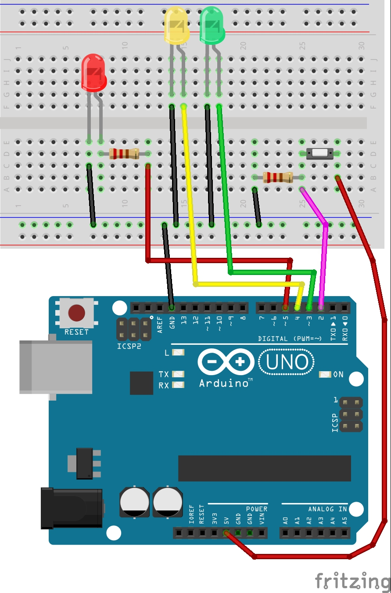
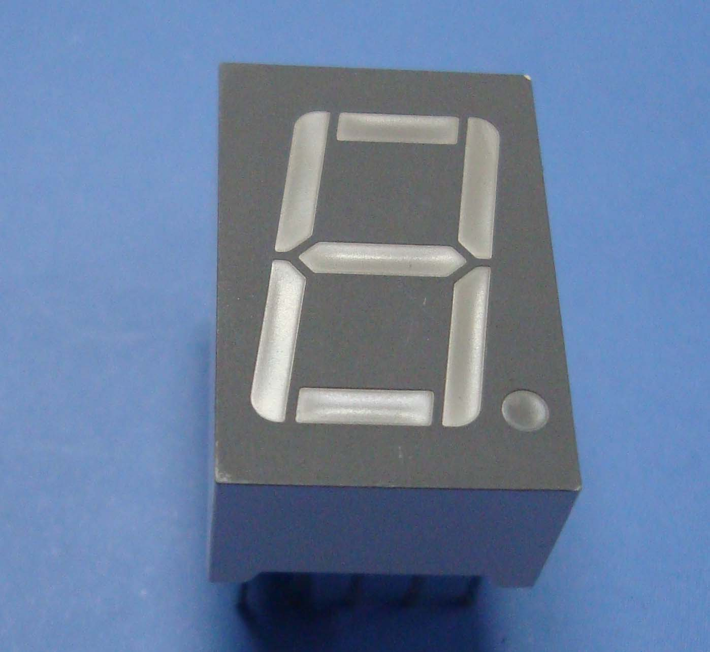
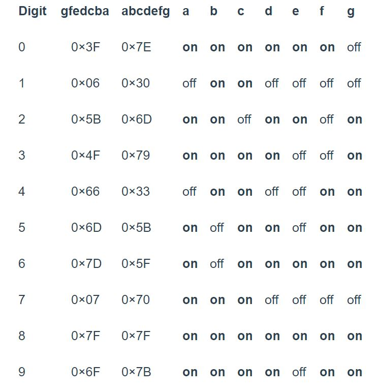

# BMES Advanced Arduino Workshop

*by Anson Fu for NTU Biomedical Engineering Society*

This workshop is based on ARDUINO IDE 1.8.5, ARDUINO UNO R3 Board and assumes basic knowledge of C++ Language and electronic protot.

***Disclaimer*** *-* *This document is only meant to serve as a reference for the attendees of the workshop. It does not cover all the concepts or implementation details discussed during the actual workshop.*

<hr>

### Workshop Details:

**When?**: Satauday, 12 May 2018. 2:00 PM - 6:00 PM.</br>
**Where?**: TR +27, The Hive, Nanyang Technological University</br>
**Who?**: NTU Biomedical Engineering Society

<hr>

## Content
### 1. Binary Counter
### 2. 7 Segment Display
### 3. Buzzer
### 4. LCD Display

## Activity 1 Binary Counter

### 1.1 Introduction to Binary
Number systems are the methods we use to represent numbers. Binary just uses two digits, 0
and 1. Binary is also known as a base-2 number system.
### 1.2 Counting In Binary
In the base-10 number system, each digit represents a value of 10x, where X is the digit
placement from the right, starting from zero and multiplying by that digit value. For example,
123 in decimal is: </br>
1×10^2+3×10^1+3×10^0=123. </br>
123 in binary would be: </br>
1×2^6+1×2^5+1×2^4+1×2^3+0×2^2+1×2^1+1×2^0=123. </br>

### 1.3 LED Binary Counter
Let's create a counter that counts in binary.


```C+
int button = 2; //set to correct pin
int presses = 0;
long time = 0;
long debounce = 100;
const byte numPins = 3; //number of pins we use
byte LEDpins[] = {3, 4, 5}; //set to correct pins

void setup() {
  Serial.begin(9600);
  for(int i = 0; i < numPins; i++) {
      pinMode(LEDpins[i], OUTPUT);
      }
  pinMode(button, INPUT_PULLUP); //monitors the state of a switch 
  attachInterrupt(0, count, LOW); //function count is triggerd when pin 0 is LOW 
  }
  
void loop() {
  String binNumber = String(presses, BIN); //give a string of binary number
  int binLength = binNumber.length(); //get the length from binary number
  boolean led0 = binNumber.charAt(binNumber.length()-1)=='1'; //search for '1' at specific location, true when '1' is found
  boolean led1 = binNumber.charAt(binNumber.length()-2)=='1';
  boolean led2 = binNumber.charAt(binNumber.length()-3)=='1';
  if(presses <= 7) {
     digitalWrite(LEDpins[0],led0);
     digitalWrite(LEDpins[1],led1);
     digitalWrite(LEDpins[2],led2);
  } else {
    presses = 0;
    }
  }
  
void count() {
  if(millis() - time > debounce){
    presses++;
    }
  time = millis();
  }
```


## Activity 2 Seven Segment Display
If your Arduino application only needs to display numbers, consider using a seven-segment display. The severn-segment display has seven LEDs arranged in the shape of number eight. They are easy to use and cost effective. The picture below shows a typical seven-segment display.</br>

### 2.1 Common Anode and Common Cathode
Seven segment displays are of two types: common anode and common cathode. The Internal structure of both types is nearly the same. The difference is the polarity of the LEDs and common terminal. </br>
#### 2.1.1 Common Cathode
In a common cathode seven-segment display, all seven LEDs plus a dot LED have the cathodes connected to pins 2 and pin 8. To use this display, we need to connect GROUND to pin 2 and pin 8 and,  and connect +5V to the other pins to make the individual segments light up.</br> 

#### 2.1.2 Common Anode
The common anode display is the exact opposite. In a common-anode display, the positive terminal of all the eight LEDs  are connected together and then connected to pin 3 and pin 8. To turn on an individual segment, you ground one of the pins. </br>
 </br>
### 2.2 Configuration
The seven segment are labelled a-g, with the dot being "dp," as shown in the figure below: </br>

To display a particular number, you turn on the individual segments as shown in the table below: </br>

### 2.3 Connect 7 segment display to Arduino Board

### 2.4 Experiments
#### 2.4.1 Turn on and off
In this experiment, we will simply turn on and turn off the LEDs to get familiar with how a seven-segment display works.
```C++
void setup()
{
  // define pin modes
  
 pinMode(2,OUTPUT);
 pinMode(3,OUTPUT);
 pinMode(4,OUTPUT);
 pinMode(5,OUTPUT);
 pinMode(6,OUTPUT);
 pinMode(7,OUTPUT);
 pinMode(8,OUTPUT);
 
}

void loop() 
{
  // loop to turn leds od seven seg ON
  
  for(int i=2;i<9;i++)
  {
    digitalWrite(i,HIGH);
    delay(600);
  }
  
  // loop to turn leds od seven seg OFF
  for(int i=2;i<9;i++)
  {
    digitalWrite(i,LOW);
    delay(600);
  }
  delay(1000);
}
```
#### 2.4.2 Show numbers
In this experiment, we will turn on specific LEDs to show numbers.
```C++
#define segA 2//connecting segment A to PIN2

#define segB 3// connecting segment B to PIN3

#define segC 4// connecting segment C to PIN4

#define segD 5// connecting segment D to PIN5

#define segE 6// connecting segment E to PIN6

#define segF 7// connecting segment F to PIN7

#define segG 8// connecting segment G to PIN8

void setup() 
{
  for (int i=2;i<9;i++) {
    pinMode(i, OUTPUT);// taking all pins from 2-8 as output
    }

}

void loop()
{  // To show number 0

   digitalWrite(segA, HIGH);

   digitalWrite(segB, HIGH);

   digitalWrite(segC, HIGH);

   digitalWrite(segD, HIGH);

   digitalWrite(segE, HIGH);

   digitalWrite(segF, HIGH);

   digitalWrite(segG, LOW);
  }
```
#### 2.4.3 Count Up 
In this experiment, we will count up numbers.
```C++
#define segA 2//connecting segment A to PIN2
#define segB 3// connecting segment B to PIN3
#define segC 4// connecting segment C to PIN4
#define segD 5// connecting segment D to PIN5
#define segE 6// connecting segment E to PIN6
#define segF 7// connecting segment F to PIN7
#define segG 8// connecting segment G to PIN8

int COUNT=0;//count integer for 0-9 increment

void setup() 
{
  for (int i=2;i<9;i++) {
    pinMode(i, OUTPUT);// taking all pins from 2-8 as output
    }

}

void loop() 
{
switch(COUNT)
{ 
  case 0://when count value is zero show”0” on disp

  digitalWrite(segA, HIGH);
  digitalWrite(segB, HIGH);
  digitalWrite(segC, HIGH);
  digitalWrite(segD, HIGH);
  digitalWrite(segE, HIGH);
  digitalWrite(segF, HIGH);
  digitalWrite(segG, LOW);

  break;

  case 1:// when count value is 1 show”1” on disp

  digitalWrite(segA, LOW);
  digitalWrite(segB, HIGH);
  digitalWrite(segC, HIGH);
  digitalWrite(segD, LOW);
  digitalWrite(segE, LOW);
  digitalWrite(segF, LOW);
  digitalWrite(segG, LOW);

  break;

  case 2:// when count value is 2 show”2” on disp

  digitalWrite(segA, HIGH);
  digitalWrite(segB, HIGH);
  digitalWrite(segC, LOW);
  digitalWrite(segD, HIGH);
  digitalWrite(segE, HIGH);
  digitalWrite(segF, LOW);
  digitalWrite(segG, HIGH);

  break;

  case 3:// when count value is 3 show”3” on disp

  digitalWrite(segA, HIGH);
  digitalWrite(segB, HIGH);
  digitalWrite(segC, HIGH);
  digitalWrite(segD, HIGH);
  digitalWrite(segE, LOW);
  digitalWrite(segF, LOW);
  digitalWrite(segG, HIGH);

  break;

  case 4:// when count value is 4 show”4” on disp

  digitalWrite(segA, LOW);
  digitalWrite(segB, HIGH);
  digitalWrite(segC, HIGH);
  digitalWrite(segD, LOW);
  digitalWrite(segE, LOW);
  digitalWrite(segF, HIGH);
  digitalWrite(segG, HIGH);

  break;

  case 5:// when count value is 5 show”5” on disp

  digitalWrite(segA, HIGH);
  digitalWrite(segB, LOW);
  digitalWrite(segC, HIGH);
  digitalWrite(segD, HIGH);
  digitalWrite(segE, LOW);
  digitalWrite(segF, HIGH);
  digitalWrite(segG, HIGH);

  break;

  case 6:// when count value is 6 show”6” on disp

  digitalWrite(segA, HIGH);
  digitalWrite(segB, LOW);
  digitalWrite(segC, HIGH);
  digitalWrite(segD, HIGH);
  digitalWrite(segE, HIGH);
  digitalWrite(segF, HIGH);
  digitalWrite(segG, HIGH);

  break;

  case 7:// when count value is 7 show”7” on disp

  digitalWrite(segA, HIGH);
  digitalWrite(segB, HIGH);
  digitalWrite(segC, HIGH);
  digitalWrite(segD, LOW);
  digitalWrite(segE, LOW);
  digitalWrite(segF, LOW);
  digitalWrite(segG, LOW);

  break;

  case 8:// when count value is 8 show”8” on disp

  digitalWrite(segA, HIGH);
  digitalWrite(segB, HIGH);
  digitalWrite(segC, HIGH);
  digitalWrite(segD, HIGH);
  digitalWrite(segE, HIGH);
  digitalWrite(segF, HIGH);
  digitalWrite(segG, HIGH);

  break;

  case 9:// when count value is 9 show”9” on disp

  digitalWrite(segA, HIGH);
  digitalWrite(segB, HIGH);
  digitalWrite(segC, HIGH);
  digitalWrite(segD, HIGH);
  digitalWrite(segE, LOW);
  digitalWrite(segF, HIGH);
  digitalWrite(segG, HIGH);

  break;

  break;
}
  if (COUNT<10) {
    COUNT++;
    delay(1000);///increment count integer for every second
   }
    if (COUNT==10) {
        COUNT=0;// if count integer value is equal to 10, reset it to zero.
         delay(1000);
     }
}
```

#### 2.4.3 Count Down
In this experiment, we will count up numbers.
```C++
// make an array to save Seven Seg pin configuration of numbers

int num_array[10][7] = {  { 1,1,1,1,1,1,0 },    // 0
                          { 0,1,1,0,0,0,0 },    // 1
                          { 1,1,0,1,1,0,1 },    // 2
                          { 1,1,1,1,0,0,1 },    // 3
                          { 0,1,1,0,0,1,1 },    // 4
                          { 1,0,1,1,0,1,1 },    // 5
                          { 1,0,1,1,1,1,1 },    // 6
                          { 1,1,1,0,0,0,0 },    // 7
                          { 1,1,1,1,1,1,1 },    // 8
                          { 1,1,1,0,0,1,1 }};   // 9
                                       
//function header
void Num_Write(int);

void setup() 
{ 
  // set pin modes
  pinMode(2, OUTPUT);   
  pinMode(3, OUTPUT);
  pinMode(4, OUTPUT);
  pinMode(5, OUTPUT);
  pinMode(6, OUTPUT);
  pinMode(7, OUTPUT);
  pinMode(8, OUTPUT);
}

void loop() 
{
  
  //counter loop
  
  for (int counter = 10; counter > 0; --counter) 
  {
   delay(1000);
   Num_Write(counter-1); 
  }
  delay(3000);
}

// this functions writes values to the sev seg pins  
void Num_Write(int number) 
{
  int pin= 2;
  for (int j=0; j < 7; j++) {
   digitalWrite(pin, num_array[number][j]);
   pin++;
  }
}
```

### Activity 3 Buzzer
In this tutorial, we are going to Interface piezo buzzer or piezo speaker with Arduino UNO. A piezo buzzer is generally used to signal user in the form of tone or beep. This type of buzzer widely used in alarm, domestic gadgets or in embedded systems product to provide some kind of indication or alert.Buy designing a small circuit we can interface it easily with Arduino. We will design a small transistorized circuit and by providing high signal we can get a tone signal from the piezo buzzer.

#### 3.1 Make some noise
```C++
const int buzzer = 9; //buzzer to arduino pin 9

void setup(){
 
  pinMode(buzzer, OUTPUT); // Set buzzer - pin 9 as an output

}

void loop(){
 
  tone(buzzer, 1000); // Send 1KHz sound signal...
  delay(1000);        // ...for 1 sec
  noTone(buzzer);     // Stop sound...
  delay(1000);        // ...for 1sec
  
}
```
#### 3.2 Play Melody
```C++
// TONES  ==========================================
// Start by defining the relationship between 
//       note, period, &  frequency. 
#define  c     3830    // 261 Hz 
#define  d     3400    // 294 Hz 
#define  e     3038    // 329 Hz 
#define  f     2864    // 349 Hz 
#define  g     2550    // 392 Hz 
#define  a     2272    // 440 Hz 
#define  b     2028    // 493 Hz 
#define  C     1912    // 523 Hz 
// Define a special note, 'R', to represent a rest
#define  R     0

// SETUP ============================================
// Set up speaker on a PWM pin
int speakerOut = 9;
// Do we want debugging on serial out? 1 for yes, 0 for no
int DEBUG = 1;

void setup() { 
  pinMode(speakerOut, OUTPUT);
  if (DEBUG) { 
    Serial.begin(9600); // Set serial out if we want debugging
  } 
}

// MELODY and TIMING  =======================================
//  melody[] is an array of notes, accompanied by beats[], 
//  which sets each note's relative length (higher #, longer note) 
int melody[] = {  C,  b,  g,  C,  b,   e,  R,  C,  c,  g, a, C };
int beats[]  = { 16, 16, 16,  8,  8,  16, 32, 16, 16, 16, 8, 8 }; 
int MAX_COUNT = sizeof(melody) / 2; // Melody length, for looping.

// Set overall tempo
long tempo = 10000;
// Set length of pause between notes
int pause = 1000;
// Loop variable to increase Rest length
int rest_count = 100; //<-BLETCHEROUS HACK; See NOTES

// Initialize core variables
int tone_ = 0;
int beat = 0;
long duration  = 0;

// PLAY TONE  ==============================================
// Pulse the speaker to play a tone for a particular duration
void playTone() {
  long elapsed_time = 0;
  if (tone_ > 0) { // if this isn't a Rest beat, while the tone has 
    //  played less long than 'duration', pulse speaker HIGH and LOW
    while (elapsed_time < duration) {

      digitalWrite(speakerOut,HIGH);
      delayMicroseconds(tone_ / 2);

      // DOWN
      digitalWrite(speakerOut, LOW);
      delayMicroseconds(tone_ / 2);

      // Keep track of how long we pulsed
      elapsed_time += (tone_);
    } 
  }
  else { // Rest beat; loop times delay
    for (int j = 0; j < rest_count; j++) { // See NOTE on rest_count
      delayMicroseconds(duration);  
    }                                
  }                                 
}

// LET THE WILD RUMPUS BEGIN =============================
void loop() {
  // Set up a counter to pull from melody[] and beats[]
  for (int i=0; i<MAX_COUNT; i++) {
    tone_ = melody[i];
    beat = beats[i];

    duration = beat * tempo; // Set up timing

    playTone(); 
    // A pause between notes...
    delayMicroseconds(pause);

    if (DEBUG) { // If debugging, report loop, tone, beat, and duration
      Serial.print(i);
      Serial.print(":");
      Serial.print(beat);
      Serial.print(" ");    
      Serial.print(tone_);
      Serial.print(" ");
      Serial.println(duration);
    }
  }
}
```
#### 3.3 Mario Bros Tunes
```C++
/*
  Arduino Mario Bros Tunes
  With Piezo Buzzer and PWM
 
  Connect the positive side of the Buzzer to pin 3,
  then the negative side to a 1k ohm resistor. Connect
  the other side of the 1 k ohm resistor to
  ground(GND) pin on the Arduino.
 
  by: Dipto Pratyaksa
  last updated: 31/3/13
*/
 
/*************************************************
 * Public Constants
 *************************************************/
 
#define NOTE_B0  31
#define NOTE_C1  33
#define NOTE_CS1 35
#define NOTE_D1  37
#define NOTE_DS1 39
#define NOTE_E1  41
#define NOTE_F1  44
#define NOTE_FS1 46
#define NOTE_G1  49
#define NOTE_GS1 52
#define NOTE_A1  55
#define NOTE_AS1 58
#define NOTE_B1  62
#define NOTE_C2  65
#define NOTE_CS2 69
#define NOTE_D2  73
#define NOTE_DS2 78
#define NOTE_E2  82
#define NOTE_F2  87
#define NOTE_FS2 93
#define NOTE_G2  98
#define NOTE_GS2 104
#define NOTE_A2  110
#define NOTE_AS2 117
#define NOTE_B2  123
#define NOTE_C3  131
#define NOTE_CS3 139
#define NOTE_D3  147
#define NOTE_DS3 156
#define NOTE_E3  165
#define NOTE_F3  175
#define NOTE_FS3 185
#define NOTE_G3  196
#define NOTE_GS3 208
#define NOTE_A3  220
#define NOTE_AS3 233
#define NOTE_B3  247
#define NOTE_C4  262
#define NOTE_CS4 277
#define NOTE_D4  294
#define NOTE_DS4 311
#define NOTE_E4  330
#define NOTE_F4  349
#define NOTE_FS4 370
#define NOTE_G4  392
#define NOTE_GS4 415
#define NOTE_A4  440
#define NOTE_AS4 466
#define NOTE_B4  494
#define NOTE_C5  523
#define NOTE_CS5 554
#define NOTE_D5  587
#define NOTE_DS5 622
#define NOTE_E5  659
#define NOTE_F5  698
#define NOTE_FS5 740
#define NOTE_G5  784
#define NOTE_GS5 831
#define NOTE_A5  880
#define NOTE_AS5 932
#define NOTE_B5  988
#define NOTE_C6  1047
#define NOTE_CS6 1109
#define NOTE_D6  1175
#define NOTE_DS6 1245
#define NOTE_E6  1319
#define NOTE_F6  1397
#define NOTE_FS6 1480
#define NOTE_G6  1568
#define NOTE_GS6 1661
#define NOTE_A6  1760
#define NOTE_AS6 1865
#define NOTE_B6  1976
#define NOTE_C7  2093
#define NOTE_CS7 2217
#define NOTE_D7  2349
#define NOTE_DS7 2489
#define NOTE_E7  2637
#define NOTE_F7  2794
#define NOTE_FS7 2960
#define NOTE_G7  3136
#define NOTE_GS7 3322
#define NOTE_A7  3520
#define NOTE_AS7 3729
#define NOTE_B7  3951
#define NOTE_C8  4186
#define NOTE_CS8 4435
#define NOTE_D8  4699
#define NOTE_DS8 4978
 
#define melodyPin 9
//Mario main theme melody
int melody[] = {
  NOTE_E7, NOTE_E7, 0, NOTE_E7,
  0, NOTE_C7, NOTE_E7, 0,
  NOTE_G7, 0, 0,  0,
  NOTE_G6, 0, 0, 0,
 
  NOTE_C7, 0, 0, NOTE_G6,
  0, 0, NOTE_E6, 0,
  0, NOTE_A6, 0, NOTE_B6,
  0, NOTE_AS6, NOTE_A6, 0,
 
  NOTE_G6, NOTE_E7, NOTE_G7,
  NOTE_A7, 0, NOTE_F7, NOTE_G7,
  0, NOTE_E7, 0, NOTE_C7,
  NOTE_D7, NOTE_B6, 0, 0,
 
  NOTE_C7, 0, 0, NOTE_G6,
  0, 0, NOTE_E6, 0,
  0, NOTE_A6, 0, NOTE_B6,
  0, NOTE_AS6, NOTE_A6, 0,
 
  NOTE_G6, NOTE_E7, NOTE_G7,
  NOTE_A7, 0, NOTE_F7, NOTE_G7,
  0, NOTE_E7, 0, NOTE_C7,
  NOTE_D7, NOTE_B6, 0, 0
};
//Mario main them tempo
int tempo[] = {
  12, 12, 12, 12,
  12, 12, 12, 12,
  12, 12, 12, 12,
  12, 12, 12, 12,
 
  12, 12, 12, 12,
  12, 12, 12, 12,
  12, 12, 12, 12,
  12, 12, 12, 12,
 
  9, 9, 9,
  12, 12, 12, 12,
  12, 12, 12, 12,
  12, 12, 12, 12,
 
  12, 12, 12, 12,
  12, 12, 12, 12,
  12, 12, 12, 12,
  12, 12, 12, 12,
 
  9, 9, 9,
  12, 12, 12, 12,
  12, 12, 12, 12,
  12, 12, 12, 12,
};
//Underworld melody
int underworld_melody[] = {
  NOTE_C4, NOTE_C5, NOTE_A3, NOTE_A4,
  NOTE_AS3, NOTE_AS4, 0,
  0,
  NOTE_C4, NOTE_C5, NOTE_A3, NOTE_A4,
  NOTE_AS3, NOTE_AS4, 0,
  0,
  NOTE_F3, NOTE_F4, NOTE_D3, NOTE_D4,
  NOTE_DS3, NOTE_DS4, 0,
  0,
  NOTE_F3, NOTE_F4, NOTE_D3, NOTE_D4,
  NOTE_DS3, NOTE_DS4, 0,
  0, NOTE_DS4, NOTE_CS4, NOTE_D4,
  NOTE_CS4, NOTE_DS4,
  NOTE_DS4, NOTE_GS3,
  NOTE_G3, NOTE_CS4,
  NOTE_C4, NOTE_FS4, NOTE_F4, NOTE_E3, NOTE_AS4, NOTE_A4,
  NOTE_GS4, NOTE_DS4, NOTE_B3,
  NOTE_AS3, NOTE_A3, NOTE_GS3,
  0, 0, 0
};
//Underwolrd tempo
int underworld_tempo[] = {
  12, 12, 12, 12,
  12, 12, 6,
  3,
  12, 12, 12, 12,
  12, 12, 6,
  3,
  12, 12, 12, 12,
  12, 12, 6,
  3,
  12, 12, 12, 12,
  12, 12, 6,
  6, 18, 18, 18,
  6, 6,
  6, 6,
  6, 6,
  18, 18, 18, 18, 18, 18,
  10, 10, 10,
  10, 10, 10,
  3, 3, 3
};
 
void setup(void)
{
  pinMode(9, OUTPUT);//buzzer
  pinMode(13, OUTPUT);//led indicator when singing a note
 
}
void loop()
{
  //sing the tunes
  sing(1);
  sing(1);
  sing(2);
}
int song = 0;
 
void sing(int s) {
  // iterate over the notes of the melody:
  song = s;
  if (song == 2) {
    Serial.println(" 'Underworld Theme'");
    int size = sizeof(underworld_melody) / sizeof(int);
    for (int thisNote = 0; thisNote < size; thisNote++) {
 
      // to calculate the note duration, take one second
      // divided by the note type.
      //e.g. quarter note = 1000 / 4, eighth note = 1000/8, etc.
      int noteDuration = 1000 / underworld_tempo[thisNote];
 
      buzz(melodyPin, underworld_melody[thisNote], noteDuration);
 
      // to distinguish the notes, set a minimum time between them.
      // the note's duration + 30% seems to work well:
      int pauseBetweenNotes = noteDuration * 1.30;
      delay(pauseBetweenNotes);
 
      // stop the tone playing:
      buzz(melodyPin, 0, noteDuration);
 
    }
 
  } else {
 
    Serial.println(" 'Mario Theme'");
    int size = sizeof(melody) / sizeof(int);
    for (int thisNote = 0; thisNote < size; thisNote++) {
 
      // to calculate the note duration, take one second
      // divided by the note type.
      //e.g. quarter note = 1000 / 4, eighth note = 1000/8, etc.
      int noteDuration = 1000 / tempo[thisNote];
 
      buzz(melodyPin, melody[thisNote], noteDuration);
 
      // to distinguish the notes, set a minimum time between them.
      // the note's duration + 30% seems to work well:
      int pauseBetweenNotes = noteDuration * 1.30;
      delay(pauseBetweenNotes);
 
      // stop the tone playing:
      buzz(melodyPin, 0, noteDuration);
 
    }
  }
}
 
void buzz(int targetPin, long frequency, long length) {
  digitalWrite(13, HIGH);
  long delayValue = 1000000 / frequency / 2; // calculate the delay value between transitions
  //// 1 second's worth of microseconds, divided by the frequency, then split in half since
  //// there are two phases to each cycle
  long numCycles = frequency * length / 1000; // calculate the number of cycles for proper timing
  //// multiply frequency, which is really cycles per second, by the number of seconds to
  //// get the total number of cycles to produce
  for (long i = 0; i < numCycles; i++) { // for the calculated length of time...
    digitalWrite(targetPin, HIGH); // write the buzzer pin high to push out the diaphram
    delayMicroseconds(delayValue); // wait for the calculated delay value
    digitalWrite(targetPin, LOW); // write the buzzer pin low to pull back the diaphram
    delayMicroseconds(delayValue); // wait again or the calculated delay value
  }
  digitalWrite(13, LOW);
 
}
```
## Activity 4 Liquid Crystal Display(LCD)
 Set Up of Liquid Crystal Display :</br>

### 4.1 "Hello World!"
```C+
// include the library code:
#include <LiquidCrystal.h>

// initialize the library by associating any needed LCD interface pin
// with the arduino pin number it is connected to
const int rs = 12, en = 11, d4 = 5, d5 = 4, d6 = 3, d7 = 2;
LiquidCrystal lcd(rs, en, d4, d5, d6, d7);

void setup() {
  // set up the LCD's number of columns and rows:
  lcd.begin(16, 2);
  // Print a message to the LCD.
  lcd.print("hello, world!");
}

void loop() {
  // set the cursor to column 0, line 1
  // (note: line 1 is the second row, since counting begins with 0):
  lcd.setCursor(0, 1);
  // print the number of seconds since reset:
  lcd.print(millis() / 1000);
}
```
</br>

### 4.2 blink() and noBlink() methods
```C++
// include the library code:
#include <LiquidCrystal.h>
const int rs = 12, en = 11, d4 = 5, d5 = 4, d6 = 3, d7 = 2;
LiquidCrystal lcd(rs, en, d4, d5, d6, d7);

void setup() {
  // set up the LCD's number of columns and rows:
  lcd.begin(16, 2);
  // Print a message to the LCD.
  lcd.print("hello, world!");
}

void loop() {
  // Turn off the blinking cursor:
  lcd.noBlink();
  delay(3000);
  // Turn on the blinking cursor:
  lcd.blink();
  delay(3000);
}
```
### 4.3 display() and noDisplay() methods
```C++
// include the library code:
#include <LiquidCrystal.h>
const int rs = 12, en = 11, d4 = 5, d5 = 4, d6 = 3, d7 = 2;
LiquidCrystal lcd(rs, en, d4, d5, d6, d7);

void setup() {
  // set up the LCD's number of columns and rows:
  lcd.begin(16, 2);
  // Print a message to the LCD.
  lcd.print("hello, world!");
}

void loop() {
  // Turn off the display:
  lcd.noDisplay();
  delay(500);
  // Turn on the display:
  lcd.display();
  delay(500);
}
```
### 4.4 scrollDisplayLeft() and scrollDisplayRight() methods
```C++
// include the library code:
#include <LiquidCrystal.h>
const int rs = 12, en = 11, d4 = 5, d5 = 4, d6 = 3, d7 = 2;
LiquidCrystal lcd(rs, en, d4, d5, d6, d7);

void setup() {
  // set up the LCD's number of columns and rows:
  lcd.begin(16, 2);
  // Print a message to the LCD.
  lcd.print("hello, world!");
  delay(1000);
}

void loop() {
  // scroll 13 positions (string length) to the left
  // to move it offscreen left:
  for (int positionCounter = 0; positionCounter < 13; positionCounter++) {
    // scroll one position left:
    lcd.scrollDisplayLeft();
    // wait a bit:
    delay(150);
  }

  // scroll 29 positions (string length + display length) to the right
  // to move it offscreen right:
  for (int positionCounter = 0; positionCounter < 29; positionCounter++) {
    // scroll one position right:
    lcd.scrollDisplayRight();
    // wait a bit:
    delay(150);
  }

  // scroll 16 positions (display length + string length) to the left
  // to move it back to center:
  for (int positionCounter = 0; positionCounter < 16; positionCounter++) {
    // scroll one position left:
    lcd.scrollDisplayLeft();
    // wait a bit:
    delay(150);
  }

  // delay at the end of the full loop:
  delay(1000);

}
```
### 4.5 autoscroll() method
```C++
// include the library code:
#include <LiquidCrystal.h>
const int rs = 12, en = 11, d4 = 5, d5 = 4, d6 = 3, d7 = 2;
LiquidCrystal lcd(rs, en, d4, d5, d6, d7);

void setup() {
  // set up the LCD's number of columns and rows:
  lcd.begin(16, 2);
}

void loop() {
  // set the cursor to (0,0):
  lcd.setCursor(0, 0);
  // print from 0 to 9:
  for (int thisChar = 0; thisChar < 10; thisChar++) {
    lcd.print(thisChar);
    delay(500);
  }

  // set the cursor to (16,1):
  lcd.setCursor(16, 1);
  // set the display to automatically scroll:
  lcd.autoscroll();
  // print from 0 to 9:
  for (int thisChar = 0; thisChar < 10; thisChar++) {
    lcd.print(thisChar);
    delay(500);
  }
  // turn off automatic scrolling
  lcd.noAutoscroll();

  // clear screen for the next loop:
  lcd.clear();
}
```
### 4.6 Text Direction methods leftToRight() and rightToLeft()
```C++
// include the library code:
#include <LiquidCrystal.h>
const int rs = 12, en = 11, d4 = 5, d5 = 4, d6 = 3, d7 = 2;
LiquidCrystal lcd(rs, en, d4, d5, d6, d7);

int thisChar = 'a';

void setup() {
  // set up the LCD's number of columns and rows:
  lcd.begin(16, 2);
  // turn on the cursor:
  lcd.cursor();
}

void loop() {
  // reverse directions at 'm':
  if (thisChar == 'm') {
    // go right for the next letter
    lcd.rightToLeft();
  }
  // reverse again at 's':
  if (thisChar == 's') {
    // go left for the next letter
    lcd.leftToRight();
  }
  // reset at 'z':
  if (thisChar > 'z') {
    // go to (0,0):
    lcd.home();
    // start again at 0
    thisChar = 'a';
  }
  // print the character
  lcd.write(thisChar);
  // wait a second:
  delay(1000);
  // increment the letter:
  thisChar++;
}
```
### 4.7 Serial Input
```C++
// include the library code:
#include <LiquidCrystal.h>
const int rs = 12, en = 11, d4 = 5, d5 = 4, d6 = 3, d7 = 2;
LiquidCrystal lcd(rs, en, d4, d5, d6, d7);

void setup() {
  // set up the LCD's number of columns and rows:
  lcd.begin(16, 2);
  // initialize the serial communications:
  Serial.begin(9600);
}

void loop() {
  // when characters arrive over the serial port...
  if (Serial.available()) {
    // wait a bit for the entire message to arrive
    delay(100);
    // clear the screen
    lcd.clear();
    // read all the available characters
    while (Serial.available() > 0) {
      // display each character to the LCD
      lcd.write(Serial.read());
    }
  }
}
```
